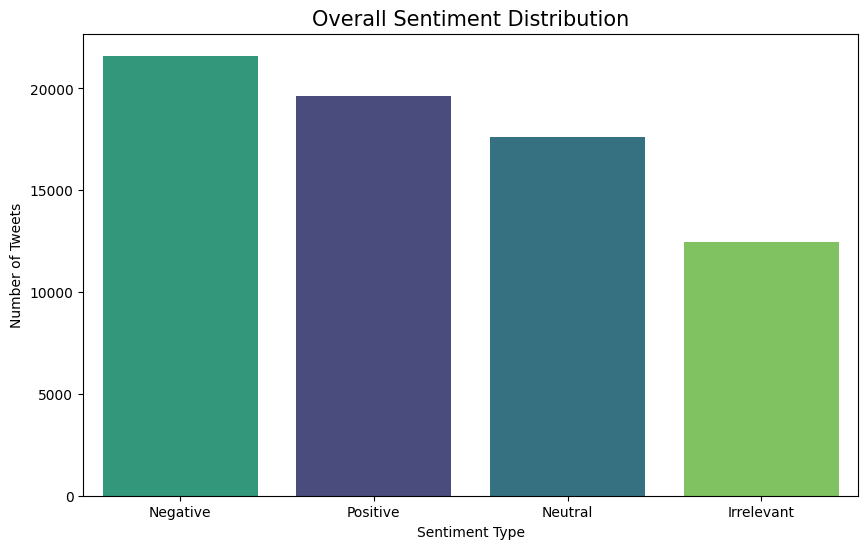
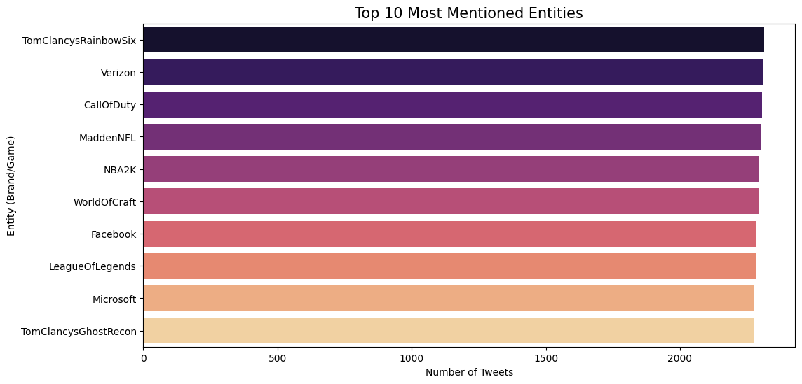
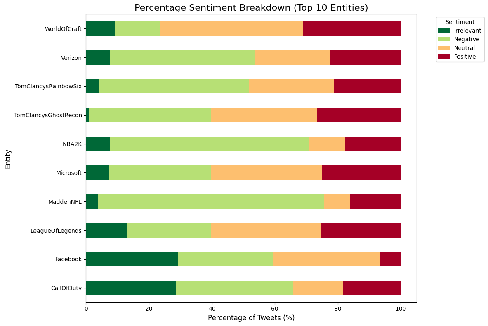
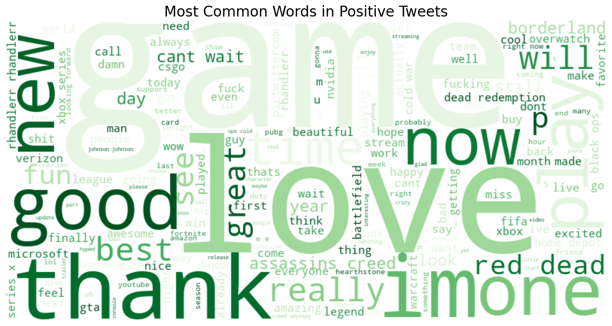
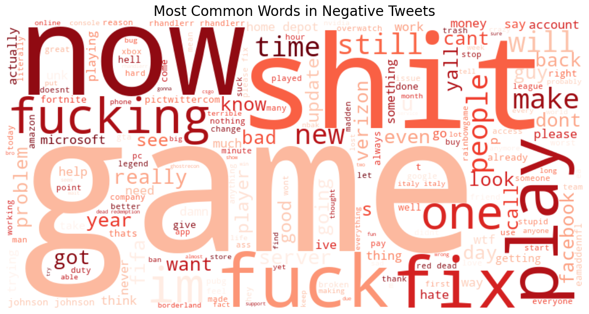
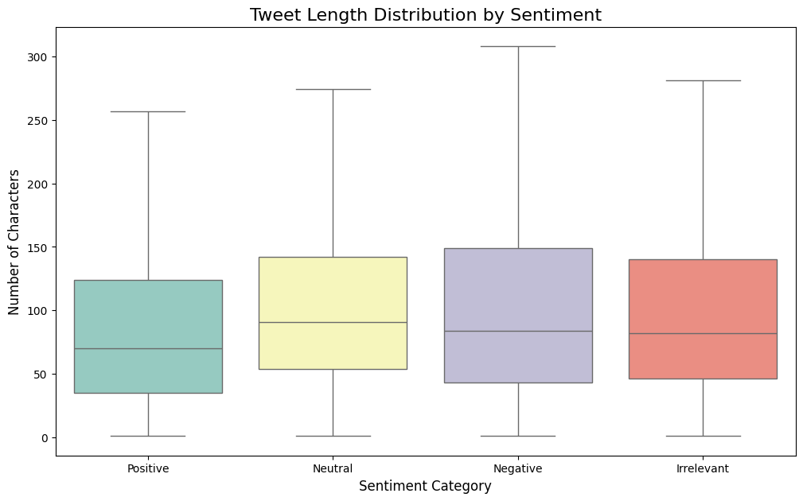
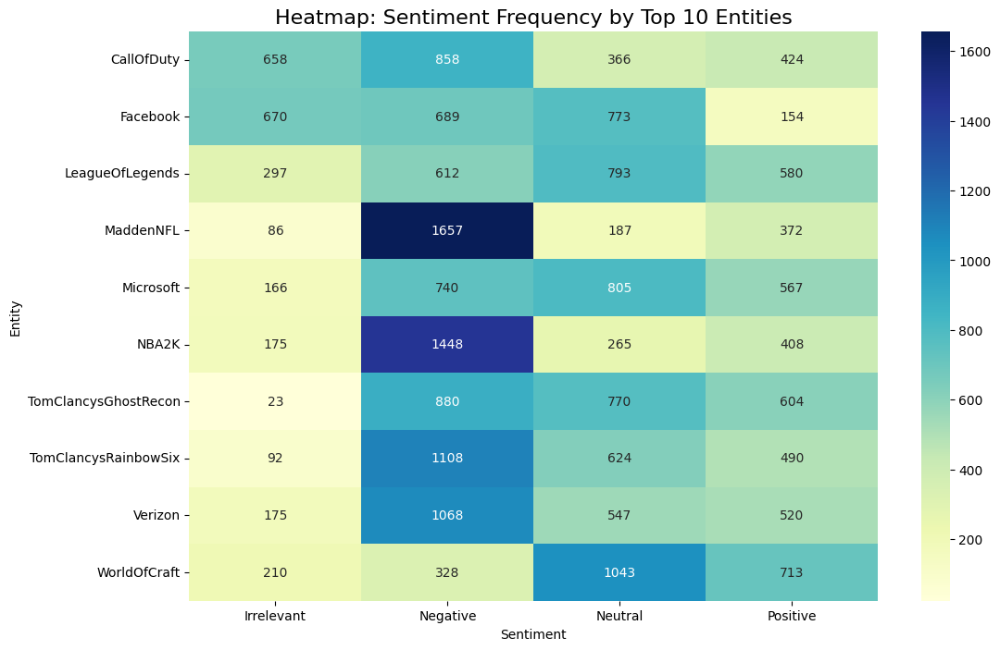
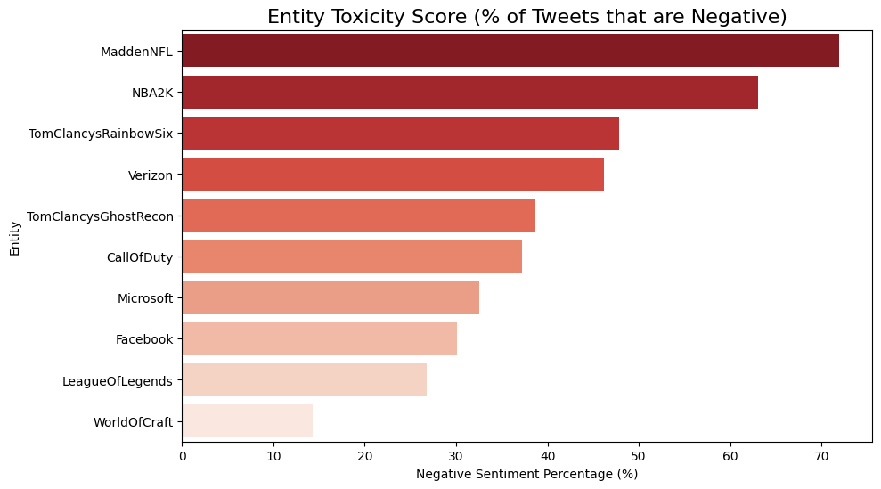

# Live Demo
Check out the interactive dashboard here: [https://twitter-sentiment-brand-analysis-6hqr3baojd5yjfx6jprtwu.streamlit.app/]
# Social Media Sentiment & Brand Reputation Analysis
**Transforming 70,000+ Raw Tweets into Actionable Marketing Insights**

## Project Overview
In the digital age, a brand's reputation can change in minutes. This project analyzes a massive real-world dataset of social media mentions (74k+ entries) to decode public perception of major tech and gaming entities. 

By leveraging **Natural Language Processing (NLP)** and **Statistical Visualization**, I identified "Toxicity Scores" for different brands and uncovered the specific technical issues driving negative consumer sentiment.

## Strategic Business Insights

* **Negativity Drives Engagement:** Analysis shows that **Negative tweets are significantly longer** than Positive ones. Frustrated users take more time to detail their "pain points" (lag, bugs, service outages) than happy users do for praise.
* **The Toxicity Leader:** **MaddenNFL** emerged as the most "toxic" entity, with the highest percentage of negative mentions relative to its total volume—indicating a critical need for PR intervention.
* **Content Strategy:** Word clouds revealed that while Positive sentiment is driven by general community "love" and "excitement," Negative sentiment is driven by specific operational words: **"Server," "Fix," "Update," and "Trash."**
* **Tech vs. Entertainment:** Big tech brands like **Microsoft** and **Google** maintain a "Neutral" dominant profile, whereas gaming brands see highly polarized (Positive/Negative) engagement.

---

## The Data Pipeline
Real-world data is messy. This project features a robust cleaning pipeline:
1.  **Missing Data Handling:** Removed rows with null content.
2.  **Deduplication:** Identified and removed **2,700+ duplicate tweets** (often caused by bot activity).
3.  **Regex Scrubbing:** Developed a custom cleaner to strip:
    * Twitter handles (@user)
    * Hyperlinks (http/https)
    * Special characters and HTML artifacts
    * Unnecessary whitespace

---

## Visual Analysis & Insights

### 1. Macro Sentiment Landscape
**What it shows:** The general "mood" of the total dataset.  
**Insight:** Negative sentiment is the most frequent category. In competitive gaming and tech industries, users are statistically more likely to post during "friction events" (bugs, lag, or outages) than during routine positive experiences.

### 2. Market Share of Conversation (Top 10 Entities)
**What it shows:** Which brands generate the most "noise" or volume.  
**Insight:** Brands like *Tom Clancy's Rainbow Six* and *MaddenNFL* dominate the volume, indicating massive, active communities that require constant monitoring.

### 3. Proportional Brand Health (100% Stacked)
**What it shows:** A comparison of sentiment ratios across entities.  
**Insight:** This reveals that while some brands have fewer total tweets, their "ratio of unhappiness" is higher, identifying brands that are struggling even if they aren't the "most talked about."

### 4. Positive vs. Negative Word Clouds
**What it shows:** The "Why" behind the feelings using text frequency.  
**Insight:** Positive sentiment is fueled by community excitement ("love," "good," "best"), while negative sentiment is pinpointed to operational failures like **"Fix," "Server," "Lag,"** and **"Update."**

### 5. Behavioral Depth Analysis (Tweet Length)
**What it shows:** A statistical comparison of how many characters users use per sentiment.  
**Insight:** Negative tweets tend to have a higher median length. This proves that **frustrated users put more effort into their content**, providing detailed "venting" compared to short positive praise.

### 6. The Toxicity Leaderboard (Ranked Risk)
**What it shows:** Ranking entities by the percentage of negative mentions.  
**Insight:** This is the most actionable chart for a PR team, identifying the "Toxicity Leaders" (like *MaddenNFL*) that require immediate community management intervention.

### 7. Cross-Category Sentiment Heatmap
**What it shows:** The density of sentiment types across the top 10 entities.  
**Insight:** Highlights specific "hot zones" where certain brands attract specific types of engagement (e.g., *Microsoft* attracting high volumes of Neutral/Support-based traffic).

---

## Tech Stack
* **Language:** Python 3.x
* **Libraries:** `Pandas`, `Matplotlib`, `Seaborn`, `WordCloud`, `Re` (Regular Expressions).
* **Dataset:** Twitter Sentiment Analysis Dataset (74,682 rows).

## Project Structure
* `Sentiment_Engagement_Analysis.ipynb`: The complete source code.
* `twitter_training.csv`: The raw dataset.
* `README.md`: Project documentation and insights.

---
**Developed by Raiyana Binte Belayet as a Data Science & Analytics Portfolio Project.**
